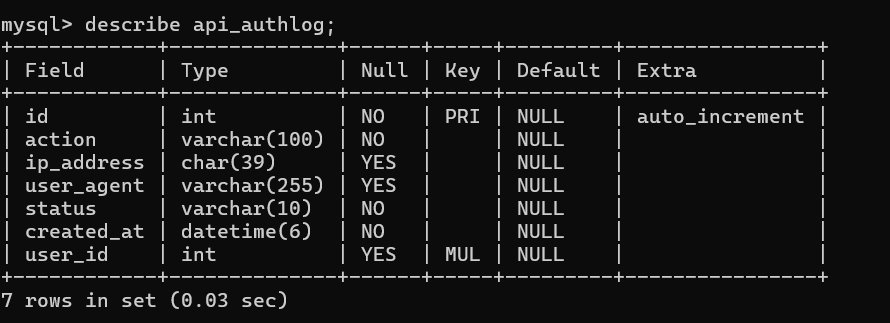

### Equivalencia Django → FastAPI

| Django                                     | FastAPI                                |
| ------------------------------------------ | -------------------------------------- |
| `django-admin startproject security_api .` | Crear carpeta del proyecto y `main.py` |
| `python manage.py runserver`               | `uvicorn app.main:app --reload`        |
| `urls.py`                                  | Routers (`APIRouter`)                  |
| Views                                      | Endpoints (`@app.get`, `@app.post`)    |
| Models ORM                                 | SQLAlchemy / SQLModel                  |
| DRF Serializers                            | Pydantic Schemas                       |
| DRF ViewSets                               | APIRouter + dependencias               |


**Comparación rápida con Django**

| Django         | FastAPI                              |
| -------------- | ------------------------------------ |
| settings.py    | Configuración manual                    |
| urls.py        | routes/                              |
| models.py      | models.py                            |
| serializers.py | schemas.py                           |
| views.py       | routes/*.py                          |
| authentication | security.py                          |
| manage.py      | No existe                            |
| ORM incluido   | instalar SQLAlchemy u otro ORM |


# (virtualenv) Preparación del entorno de trabajo.

Creación de un entorno virtual es un “Python aislado” para proyecto Django. =>
  No mezclar dependencias entre proyectos, evitar conflictos de versiones (Django, DRF, MySQL, etc.), tener un entorno reproducible...

**Crear entorno virtual**. Windows:

```bash
python -m venv venv
```

Esto crea una carpeta:

```
security_api/
 ├── venv/
```

**Activar el entorno virtual**


```bash
venv\Scripts\activate
```
Dentro del entorno virtual

```bash
(venv) user@pc:security_api$
```
---

**Instalar Django y DRF dentro del entorno**. IMPORTANTE: siempre con el entorno activado

```bash
pip install django
pip install djangorestframework
pip install djangorestframework-simplejwt
pip install pymysql
pip install corsheaders
```

---

**Guardar dependencias**. Reproducir el proyecto.

```bash
pip freeze > requirements.txt
```

**Crear proyecto Django** El punto `.` significa “en esta carpeta”

```bash
django-admin startproject security_api .
```

---

Estructura:

```
security_api/
 ├── manage.py (creado automáticamente)
 ├── security_api/
 │    ├── settings.py  (creado automáticamente, modificación manual)
 │    ├── urls.py  (creado automáticamente)
 │    ├── asgi.py  (creado automáticamente)
 │    ├── wsgi.py  (creado automáticamente)
```

---

**Crear la app principal (api)**

```bash
python manage.py startapp api
```

Estructura:

```
api/
 ├── models.py (creado automáticamente, modificación manual)
 ├── views.py  (creado automáticamente, modificación manual)
 ├── urls.py (creado manualmente)
 ├── serializers.py (creado manualmente)
 ├── permissions.py (creado manualmente)
 ├── authentication.py (creado manualmente)
```

---

**Activar la app en settings.py**

En:

```python
INSTALLED_APPS = [
```

añades:

```python
'rest_framework',
'rest_framework_simplejwt',
'corsheaders',
'api',
```

---

**Configurar entorno REST (muy básico inicial) en settingd.py**

```python
REST_FRAMEWORK = {
    'DEFAULT_AUTHENTICATION_CLASSES': (
        'api.authentication.CookieJWTAuthentication',
    ),
}
```

---

**Configurar base de datos MySQL**

```python
DATABASES = {
    'default': {
        'ENGINE': 'django.db.backends.mysql',
        'NAME': 'security_db',
        'USER': 'root',
        'PASSWORD': 'tu_password',
        'HOST': 'localhost',
        'PORT': '3306',
    }
}
```

---

**Migraciones (CREAR TABLAS)**

Esto es clave en Django.

```bash
python manage.py makemigrations
python manage.py migrate
```
Esto crea todas las tablas automáticamente.

---

**Crear usuario admin**

```bash
python manage.py createsuperuser
```

---

**Ejecutar servidor**

```bash
python manage.py runserver
```

Y entras en:

```
http://127.0.0.1:8000/
```

Admin:

```
http://127.0.0.1:8000/admin/
```
---

**Estructura mental correcta**

Django REST funciona así:

```
Modelo → Base de datos  **class User(models.Model):** => Migraciones
Serializer → JSON       **class UserSerializer(serializers.ModelSerializer):**
View → Lógica           **class UserViewSet(viewsets.ModelViewSet):**
URL → Endpoint          **router.register('usuarios', UserViewSet)**
```
---

**Cómo saber si todo está bien**

Pruebas básicas:

* `/admin/` funciona → Django OK
* `/api/` responde → DRF OK
* migraciones sin errores → DB OK

---

# Implementación de persistencia y seguridad en Django REST Framework

**Uso de migraciones frente a scripts SQL manuales**

Aunque inicialmente se contempló la posibilidad de definir un script SQL de inicialización,`init.sql` para crear manualmente la base de datos, finalmente se optó por utilizar el sistema nativo de migraciones proporcionado por Django.

Este enfoque permite:

* generar automáticamente las tablas necesarias,
* mantener sincronizado el modelo lógico y físico,
* versionar cambios estructurales,
* evitar inconsistencias manuales,
* y simplificar la evolución futura del esquema de datos.

La estructura de la base de datos se genera a partir de los modelos Python definidos en la aplicación mediante los comandos:

```bash
python manage.py makemigrations
python manage.py migrate
```

El framework transforma automáticamente las clases del modelo en tablas MySQL.

---

# Estructura del proyecto Django

El proyecto se organiza en dos componentes principales:

## Proyecto principal: `security_api`

Contiene:

* configuración global,
* arranque del servidor,
* definición de rutas principales,
* configuración ASGI/WSGI.

## Aplicación: `api`

Contiene:

* modelos de negocio,
* autenticación,
* permisos,
* serializadores,
* vistas REST,
* lógica personalizada de seguridad.

---

# Análisis de cada fichero. Proyecto principal:  `security_api`

# 1. `manage.py`. Código completo

```python
#!/usr/bin/env python    
# Indica el intérprete Python que ejecutará el archivo.
# Permite ejecutar el script directamente desde terminal en sistemas Unix/Linux.


"""Django's command-line utility for administrative tasks."""
# Descripción general del archivo.
# manage.py es la utilidad principal de Django para ejecutar tareas administrativas.

import os
# Librería estándar de Python para interactuar con el sistema operativo.
# Se utiliza aquí para manejar variables de entorno.
import sys
# Librería estándar para acceder a argumentos y funcionalidades del sistema.
# Permite leer argumentos pasados desde línea de comandos.


def main():
    """Run administrative tasks."""
    # Función principal encargada de ejecutar los comandos administrativos de Django.

    # Define la variable de entorno que indica cuál es el archivo principal
    # de configuración del proyecto Django.
    # En este caso apunta a: security_api/settings.py
    os.environ.setdefault('DJANGO_SETTINGS_MODULE', 'security_api.settings')
    try:
        # Importa el sistema interno de gestión de comandos de Django.
        # Este módulo permite ejecutar comandos administrativos desde terminal.
        from django.core.management import execute_from_command_line # Importa el sistema de comandos administrativos de Django.
    except ImportError as exc:
        # Captura errores si Django no está instalado correctamente
        # o el entorno virtual no está activado.
        raise ImportError(
            "Couldn't import Django. Are you sure it's installed and "
            "available on your PYTHONPATH environment variable? Did you "
            "forget to activate a virtual environment?"
        ) from exc
    execute_from_command_line(sys.argv)  # Permite ejecutar comandos como:
                                         # python manage.py runserver
                                         # python manage.py migrate
                                         # python manage.py createsuperuser
    # Ejecuta el comando recibido desde la terminal.
    # sys.argv contiene los argumentos introducidos por el usuario.

# Comprueba si el archivo está siendo ejecutado directamente
# y no importado desde otro módulo.

if __name__ == '__main__':
    # Ejecuta la función principal.
    main()
```

**Todo el archivo es generado automáticamente por Django.**, No hay implementación personalizada.

---
# 2. `security_api/__init__.py`. Código completo

```python
import pymysql
pymysql.install_as_MySQLdb() # Haz que PyMySQL se comporte como si fuera MySQLdb
```

Permite utilizar PyMySQL como adaptador de conexión MySQL para Django.
Django espera normalmente el driver `MySQLdb`.
En el proyecto se utiliza `PyMySQL`, esta instrucción hace que Django lo reconozca como compatible.
**PyMySQL** es una librería de Python que sirve para **conectarse a bases de datos MySQL**. Es un **driver (conector)** entre Python y MySQL.

PyMySQL:

- está escrito 100% en Python
- es más fácil de instalar
- no necesita compilación

Permite que tu código Python pueda:
- conectarse a MySQL
- ejecutar consultas SQL
- leer datos de tablas
- insertar / actualizar / borrar registros

> Python → PyMySQL → MySQL 

``` python
User.objects.all()
```
Django ORM → PyMySQL → MySQL → datos

---

* PyMySQL = conector Python ↔ MySQL
* permite que Django hable con MySQL
* es más fácil que mysqlclient
* se activa con `install_as_MySQLdb()`

---

* (Framework) Django soporta conexión MySQL.

* Configuración específica para usar PyMySQL.

---

# 3. `asgi.py`. código completo

```python
# Manejo de variables de entorno y sistema operativo
import os # Importa el módulo os, que permite interactuar con el sistema operativo. Variables de entorno

# Crea la aplicación ASGI de Django
from django.core.asgi import get_asgi_application # Importa la función que crea la aplicación ASGI de Django. 
                                                  # ASGI es la interfaz que permite que Django maneje conexiones asíncronas (websockets, HTTP async, etc.
# Define el módulo de configuración de Django si no está ya definido
os.environ.setdefault('DJANGO_SETTINGS_MODULE', 'security_api.settings') # Define la variable de entorno DJANGO_SETTINGS_MODULE si no está ya definida.
                                                                         # DJANGO_SETTINGS_MODULE le dice a Django dónde están las configuraciones del proyecto.
                                                                         # 'security_api.settings' es el módulo de settings de tu proyecto.
                                                                         # Django: usa estos settings para arrancar.
# Inicializa la aplicación ASGI que servirá como punto de entrada del proyecto
application = get_asgi_application()  # Crea la aplicación ASGI de Django y la expone en la variable application.
                                      # Esta variable es la que usan servidores como Uvicorn o Daphne para ejecutar tu app.
                                      # Es el punto de entrada del proyecto en modo ASGI.
```
Carga la aplicación ASGI.

---

ASGI permite:

* aplicaciones asíncronas,
* WebSockets,
* comunicaciones en tiempo real,
* mejor concurrencia.

Todo generado automáticamente por Django.

---

# 4. `wsgi.py`. Código completo

Similar a `asgi.py`, pero orientado a servidores WSGI tradicionales.

---

```python
# Importa el módulo os, que permite trabajar con el sistema operativo, especialmente con variables de entorno.
import os  # Interacción con el sistema operativo y variables de entorno

# Importa la función que crea la aplicación WSGI de Django.
# WSGI es la interfaz estándar para ejecutar aplicaciones web Python en servidores tradicionales (como Gunicorn o uWSGI).
# Es el “punto de entrada” para despliegues síncronos.
from django.core.wsgi import get_wsgi_application  # Crea la aplicación WSGI de Django

# Define el módulo de configuración del proyecto si no está ya definido
os.environ.setdefault('DJANGO_SETTINGS_MODULE', 'security_api.settings') # Define la variable de entorno DJANGO_SETTINGS_MODULE si no está ya configurada.
                                                                         # Le dice a Django dónde están las configuraciones del proyecto.
                                                                         # 'security_api.settings' apunta al archivo settings.py del proyecto.
                                                                         # indica qué configuración debe cargar Django para arrancar.

# Inicializa la aplicación WSGI (punto de entrada del servidor web)
application = get_wsgi_application()
```

Permite desplegar Django en servidores como:

* Gunicorn,
* uWSGI,
* Apache mod_wsgi.

Generado automáticamente.

---

# 5. `settings.py`. código completo.

Contiene:

* configuración de base de datos,
* aplicaciones instaladas,
* middleware,
* JWT,
* seguridad HTTPS,
* configuración REST,
* CORS,
* cookies seguras.

---

Implementación propia. Especialmente:

* configuración MySQL,
* JWT,
* seguridad,
* apps instaladas.

El fichero settings.py constituye el núcleo de configuración del proyecto Django. En él se centralizan todos los parámetros relacionados con el funcionamiento de la aplicación, incluyendo la conexión a la base de datos, los componentes instalados, la configuración REST, los mecanismos de autenticación y las políticas de seguridad.

A diferencia de otros archivos generados automáticamente por Django, este fichero incorpora una parte importante de configuración personalizada desarrollada específicamente para el proyecto.

Entre las configuraciones más relevantes implementadas destacan:

- integración con MySQL,
- configuración del sistema REST,
- autenticación JWT,
- uso de cookies seguras,
- configuración HTTPS,
- middleware de seguridad,
- registro de aplicaciones propias.
- Configuración de la base de datos

``` python

import pymysql # Importa la librería PyMySQL: conector entre Python y MySQL.
pymysql.install_as_MySQLdb() # Usa PyMySQL como si fuera MySQLdb

from pathlib import Path # Importa la clase Path para trabajar con rutas de archivos.
import os # Importa el módulo del sistema operativo.
from dotenv import load_dotenv # Importa la función para cargar archivos .env.

load_dotenv() # Carga esas variables en Python.


# Build paths inside the project like this: BASE_DIR / 'subdir'.
BASE_DIR = Path(__file__).resolve().parent.parent # Permite manejar rutas del sistema de forma segura y moderna.
                                                  # compatibilidad entre Windows / Linux / Mac

# Quick-start development settings - unsuitable for production
# See https://docs.djangoproject.com/en/6.0/howto/deployment/checklist/

# SECURITY WARNING: keep the secret key used in production secret!
# Clave secreta interna de Django. Nunca debe exponerse en producción. Guardarla en .env.
SECRET_KEY = 'django-insecure-!9!r&5r&9zr=89+!7x+kt!+=#(=(pnec!s#7(*&jqy-4xk=r$y'

# SECURITY WARNING: don't run with debug turned on in production!
# DEBUG = True # Activa modo desarrollo. En producción es peligroso porque puede revelar: rutas internas, consultas SQL, variables sensibles, configuración.

# Define qué dominios pueden acceder al servidor Django.
# Previene ataques de tipo: Host Header Injection
ALLOWED_HOSTS = []
ALLOWED_HOSTS = ['127.0.0.1', 'localhost']


# Application definition
# Lista de aplicaciones activas en Django.

INSTALLED_APPS = [
    'django.contrib.admin',  # Panel administrativo de Django. 
    'django.contrib.auth',   # Sistema de autenticación
    'django.contrib.contenttypes', # Permite a Django relacionar modelos dinámicamente.
    'django.contrib.sessions', # Sistema de sesiones de usuarios.
    'django.contrib.messages', # Sistema de mensajes temporales. "Usuario creado correctamente"
    'django.contrib.staticfiles', # Gestiona archivos estáticos:
    'rest_framework',  # Django REST Framework. Activa DRF
    'api',             # Tu app donde creaste la API. App personalizada
    'corsheaders',     # cabeceras CORS
    'csp',             # cabeceras de seguridad csp. Activa Content Security Policy.
    "django_extensions", # Herramientas extra para desarrollo. Generar diagramas, shell avanzado, utilidades de debugging
]

"""
Un middleware es un componente intermedio que intercepta y 
procesa las peticiones y respuestas HTTP durante el ciclo de 
ejecución de una aplicación web, permitiendo implementar 
funcionalidades globales como autenticación, seguridad, 
sesiones o validación de solicitudes.
"""
MIDDLEWARE = [
    'corsheaders.middleware.CorsMiddleware',# Gestiona CORS
    'django.middleware.security.SecurityMiddleware', # Middleware de seguridad nativo
    'django.contrib.sessions.middleware.SessionMiddleware', # Gestiona sessiones de usuario
    'django.middleware.common.CommonMiddleware', # Funciones HTTP generales: normalización URLs, petición básica
    'django.middleware.csrf.CsrfViewMiddleware', # Protección frente a ataques CSRF
    'django.contrib.auth.middleware.AuthenticationMiddleware', # Asocia usuario autenticado a cada request. " request.user"
    'django.contrib.messages.middleware.MessageMiddleware', # Mensajes temporales del sistema
    'django.middleware.clickjacking.XFrameOptionsMiddleware', # Protege frente a Clickjacking. Evita iframes maliciosos
    'csp.middleware.CSPMiddleware', # cabeceras de seguridad csp. Aplica políticas CSP al navegador
]

# Define que fronteds pueden hacer peticiones. Fronted permitido.
CORS_ALLOWED_ORIGINS = [ #http 5500. Puerto 
    "https://127.0.0.1:5501",  
    "https://localhost:5501",
]

CORS_ALLOW_CREDENTIALS = True # Permite envío de cookies. Necesario para JWT en cookies HTTPOnly

# Define políticas CSP.
CONTENT_SECURITY_POLICY = {
    "DIRECTIVES": {
        "default-src": ("'self'",), # solo permite recursos del mismo dominio.
        "script-src": ("'self'",),  # bloquea scripts externos. Reduce XSS.
        "style-src": ("'self'",),   # solo CSS local.
        "img-src": ("'self'", "data:"), # permite imágenes locales y base64
    }
}

# Archivo principal de rutas.
ROOT_URLCONF = 'security_api.urls'

# Configuración del motor de plantillas HTML.
TEMPLATES = [
    {
        'BACKEND': 'django.template.backends.django.DjangoTemplates', # Motor de plantilla usar
        'DIRS': [],  # Define carpetas globales donde Django buscará templates HTML.
        'APP_DIRS': True,
        'OPTIONS': { # Configuraciones adicionales del motor de plantillas.
            'context_processors': [ # Son funciones que inyectan variables automáticamente en TODOS los templates.
                'django.template.context_processors.request', # hace disponible el request dentro del HTML.
                'django.contrib.auth.context_processors.auth', # variables relacionadas con autenticación
                'django.contrib.messages.context_processors.messages', # Permite mostrar mensajes temporales en HTML.
            ],
        },
    },
]

# Punto de entrada WSGI
WSGI_APPLICATION = 'security_api.wsgi.application'


# Database
# https://docs.djangoproject.com/en/6.0/ref/settings/#databases
# Configuración de MySQL.
DATABASES = {
    'default': {
        'ENGINE': 'django.db.backends.mysql', # Motor MySQL. Variables de entorno. lee los datos de .env
        'NAME': os.getenv("MYSQL_DATABASE"),
        'USER': os.getenv("MYSQL_USER"),
        'PASSWORD': os.getenv("MYSQL_PASSWORD"),
        'HOST': os.getenv("MYSQL_HOST"),
        'PORT': os.getenv("MYSQL_PORT"),
    }
}

"""
# Password validation
# https://docs.djangoproject.com/en/6.0/ref/settings/#auth-password-validators

AUTH_PASSWORD_VALIDATORS = [
    {
        'NAME': 'django.contrib.auth.password_validation.UserAttributeSimilarityValidator',
    },
    {
        'NAME': 'django.contrib.auth.password_validation.MinimumLengthValidator',
    },
    {
        'NAME': 'django.contrib.auth.password_validation.CommonPasswordValidator',
    },
    {
        'NAME': 'django.contrib.auth.password_validation.NumericPasswordValidator',
    },
]

"""
# Internationalization
# https://docs.djangoproject.com/en/6.0/topics/i18n/

LANGUAGE_CODE = 'en-us'  # Idioma del sistema

TIME_ZONE = 'UTC'   # Zona horaria

USE_I18N = True     # Internacionalización activada

USE_TZ = True       # usa fechas con timezone


# Static files (CSS, JavaScript, Images)
# https://docs.djangoproject.com/en/6.0/howto/static-files/

STATIC_URL = 'static/'  # Ruta de archivos estáticos

"""REST_FRAMEWORK = {  # autenticación sin cookie.
    'DEFAULT_AUTHENTICATION_CLASSES': (
        'rest_framework_simplejwt.authentication.JWTAuthentication',
    ),
    'DEFAULT_PERMISSION_CLASSES': (
        'rest_framework.permissions.IsAuthenticated',
    ),
}
"""
REST_FRAMEWORK = {
    "DEFAULT_AUTHENTICATION_CLASSES": (
        "api.authentication.CookieJWTAuthentication",  # autenticación personalizada JWT por cookies
    ),
    "DEFAULT_PERMISSION_CLASSES": (
        "rest_framework.permissions.IsAuthenticated", # Todas las rutas requieren login por defecto
    )
}

from datetime import timedelta
# Configuración JWT.
SIMPLE_JWT = {
    'ACCESS_TOKEN_LIFETIME': timedelta(minutes=30), # Duración token acceso
    'REFRESH_TOKEN_LIFETIME': timedelta(days=1),    # Duración token renovavión
    'AUTH_HEADER_TYPES': ('Bearer',),    # Formato estándar
}

# Define backend autenticación Django.
AUTHENTICATION_BACKENDS = [
    'django.contrib.auth.backends.ModelBackend', # Backend estándar Django.
]

```

# 6. `urls.py`. Código completo

```python
# Importa el módulo del panel de administración de Django.
# admin permite acceder a la interfaz automática de administración que Django genera.
from django.contrib import admin  # Panel de administración de Django

# Importa dos funciones clave para manejar rutas (URLs):
# path: se usa para definir rutas concretas.
# include: permite incluir rutas definidas en otros archivos urls.py (útil para modularizar proyectos).
from django.urls import path, include  # Herramientas para definir e incluir rutas

# Lista de rutas del proyecto
urlpatterns = [                        # Lista principal donde se registran todas las rutas del proyecto. Django usa esta lista para saber qué vista ejecutar según la URL solicitada.

    # Ruta del panel de administración
    path('admin/', admin.site.urls),  # Define la ruta del panel de administración:
                                      # 'admin/' → URL que se escribe en el navegador (por ejemplo: /admin/)
                                      # admin.site.urls → conjunto de rutas internas del panel de admin
                                      # Activa el panel de administración de Django.

    # Conecta las rutas de la app "api" bajo el prefijo /api/
    path('api/', include('api.urls')),  # Define una ruta base para tu aplicación api.
                                        # 'api/' → todas las rutas que empiecen con /api/
                                        # include('api.urls') → delega el manejo de esas rutas al archivo urls.py dentro de la app api

    # Esto significa:
    # /api/users/
    # /api/login/
    # etc.
    # se gestionan dentro de api/urls.py.
]
```

---

Define las rutas principales del sistema.

**`/admin/`**: Panel administrativo nativo de Django.

**`/api/`**: Conecta todas las rutas REST desarrolladas en la aplicación `api`.

**Implementado por el Framework**: sistema de routing.

**Implementación manula**:organización de endpoints REST.


# Análisis de cada fichero. Aplicación `api`
---

# 1. `authentication.py`. código completo

Este archivo solo es necesario si estás usando autenticación con JWT almacenado en cookies del navegador, ya que en ese caso se encarga de leer el token desde `request.COOKIES` y validar al usuario a partir de él.

Si en cambio estás enviando el token en las cabeceras HTTP (por ejemplo, `Authorization: Bearer <token>`), entonces no hace falta esta clase personalizada porque Django REST Framework ya incluye `JWTAuthentication` para ese propósito, por lo que este archivo sería innecesario en ese escenario.

Se crea en el proyecto Django para la migración a cookes.

```python
# Importa la clase base de autenticación JWT de djangorestframework-simplejwt.
# Esta clase ya trae la lógica estándar para trabajar con tokens JWT.
# La vamos a extender para cambiar la forma en la que se obtiene el token (en este caso desde cookies). 
from rest_framework_simplejwt.authentication import JWTAuthentication  # Autenticación JWT base

# Clase personalizada que obtiene el token desde cookies
class CookieJWTAuthentication(JWTAuthentication):  # Define una nueva clase llamada CookieJWTAuthentication que hereda de JWTAuthentication.
                                                   # Con esta clase:
                                                   # Reutilizas toda la lógica de JWT.
                                                   # Se pueden modificar partes específicas (dónde se busca el token).

    # Método que se ejecuta en cada request para autenticar al usuario
    def authenticate(self, request):  # Sobrescribe el método authenticate.
                                      # Este método es el que Django REST Framework llama para autenticar cada request.
                                      # Aquí se decide cómo obtener y validar el usuario.

        # Obtener el token JWT desde la cookie "access_token"
        token = request.COOKIES.get("access_token")  # Busca el token JWT dentro de las cookies de la petición HTTP.
                                                     # request.COOKIES es un diccionario con todas las cookies enviadas por el navegador.
                                                     # "access_token" es el nombre de la cookie donde esperas el JWT.

                                                     # diferencia del método típico (Authorization header), aquí se usa cookies.

        # Si no hay token, no se autentica al usuario
        if not token:        # Si no existe el token en las cookies:
                             # No intentas autenticar al usuario.
                             # Devuelves None, lo que significa “usuario no autenticado”.
            return None

        # Validar el token (firma, expiración, etc.)
        validated_token = self.get_validated_token(token)  # Valida el JWT:
                                                           # Comprueba firma, expiración y estructura del token.
                                                           # Si el token es inválido, lanzará una excepción.

        # Obtener el usuario asociado al token
        user = self.get_user(validated_token)             # Obtiene el usuario asociado al token validado:
                                                          # Busca el usuario en la base de datos usando la información dentro del JWT (el user_id)

        # Devolver usuario autenticado y el token validado
        return (user, validated_token)                   # Devuelve una tupla con:
                                                         # user → el usuario autenticado
                                                         # validated_token → el token JWT ya verificado

        # Esto es lo que Django REST Framework espera para considerar la autenticación exitosa.
```

Clase personalizada de autenticación JWT.

Django SimpleJWT normalmente espera el token en: Authorization: Bearer TOKEN

Pero la implementación cambia el comportamiento para leer el token desde cookies HTTPOnly: token = request.COOKIES.get("access_token")

**Ventaja de seguridad**. Reduce exposición frente a:
* robo mediante JavaScript,
* ataques XSS.

**Implementado por el Framework**: `JWTAuthentication`.

**Implementación manual**: lectura personalizada desde cookies.

---

# 2. `models.py`. código completo

El archivo `models.py` en Django se utiliza para definir la estructura de la base de datos mediante clases de Python, donde cada clase representa una tabla y cada atributo representa una columna con sus tipos de datos, relaciones y reglas. A través del ORM de Django, estos modelos permiten crear, consultar, actualizar y eliminar datos de la base de datos sin escribir SQL directamente, facilitando el manejo de la información de la aplicación de forma organizada, segura y escalable.

En este proyecto Django, únicamente se ha definido de forma explícita el modelo `AuthLog` en el archivo `models.py`, ya que representa una tabla personalizada creada específicamente para registrar eventos de autenticación dentro de la aplicación. El resto de tablas necesarias, como las relacionadas con usuarios, permisos o sesiones, no han sido implementadas manualmente, puesto que ya vienen predefinidas e integradas en el framework Django a través de su sistema de autenticación y sus aplicaciones incorporadas. De este modo, Django se encarga automáticamente de la creación y gestión de dichas tablas mediante su ORM, permitiendo al desarrollador centrarse únicamente en las entidades propias del negocio que requiere la aplicación.

```python
# Importa el módulo de modelos de Django, que permite definir tablas de la base de datos como clases Python.
from django.db import models  # Sistema de modelos (ORM) de Django

# Importa el modelo User predeterminado de Django.
# Este modelo representa a los usuarios del sistema. Se usará para relacionar cada log con un usuario.
from django.contrib.auth.models import User  # Modelo de usuario por defecto

# Modelo que registra eventos de autenticación
class AuthLog(models.Model):  # Define un modelo llamado AuthLog.
                              # Representa una tabla en la base de datos. Se usará para registrar eventos de autenticación (logs).

    # Usuario relacionado con el evento (puede ser nulo)
    user = models.ForeignKey(User, null=True, on_delete=models.SET_NULL)  # Campo que relaciona el log con un usuario.
                                                                          # ForeignKey(User) → relación con el modelo User
                                                                          # null=True → permite que el log no tenga usuario (ejemplo: intentos fallidos)
                                                                          # on_delete=models.SET_NULL → si el usuario se elimina, el campo queda en NULL en lugar de borrar el log

    # Tipo de acción realizada (login, logout, etc.)
    action = models.CharField(max_length=100)    # Campo de texto corto que indica la acción realizada. ("login", "logout", "password_change")

    # Dirección IP desde la que se realizó la acción
    ip_address = models.GenericIPAddressField(null=True)   # Guarda la dirección IP desde la que se realizó la acción.
                                                           # GenericIPAddressField soporta IPv4 e IPv6
                                                           # null=True permite que esté vacío

    # Información del navegador o cliente
    user_agent = models.CharField(max_length=255, null=True)  # Guarda el User-Agent del navegador o cliente.
                                                              # Permite identificar desde qué navegador o dispositivo se hizo la petición
                                                              # Puede ser null si no se envía

    # Estado del evento (success, failed, etc.)
    status = models.CharField(max_length=10)     # Indica el resultado de la acción.("success", "failed")

    # Fecha de creación automática del registro
    created_at = models.DateTimeField(auto_now_add=True)  # Fecha y hora en la que se creó el registro.
                                                          # auto_now_add=True → se asigna automáticamente cuando se crea el log
                                                
    # Representación en texto del objeto
    def __str__(self):
        return f"{self.action} - {self.status}"   # Define cómo se mostrará el objeto en el admin de Django o en la consola.
                                                  # Devuelve un texto legible: login - success
```

Se ha creado un modelo personalizado de auditoría. 


**Campos tabla**: Usuario relacionado, Acción realizada, IP origen, Navegador/dispositivo, Código HTTP, Fecha automática.

**Que registra**: login, errores, cambios de contraseña, borrado de usuarios, eventos críticos.

---

Cuando se define la clase: class AuthLog(models.Model):
Django no crea la tabla solo con el nombre `authlog`, sino que le añade automáticamente el **prefijo del nombre de la aplicación**, en el proyecto `api`. La tabla queda como: api_authlog

* App → `api`
* Modelo → `AuthLog`

Resultado: api + authlog = api_authlog
Django no crea la tabla solo con el nombre `authlog`, sino que le añade automáticamente el **prefijo del nombre de la aplicación**, en tu caso `api`.


Se puede definir manualmente: Esto haría que la tabla se llame exactamente `auth_log` en la base de datos.

```python
class AuthLog(models.Model):
    ...

    class Meta:
        db_table = "auth_log"
```

Django añade automáticamente el prefijo `api_` porque sigue su convención de nombrado de tablas: primero el nombre de la aplicación y después el nombre del modelo. En este caso, `AuthLog` dentro de la app `api` genera la tabla `api_authlog`. Este comportamiento puede personalizarse mediante la opción `db_table` en la clase `Meta` del modelo.


**Implementación Framework**: ORM Django.

**Implementación propia**: diseño del modelo de auditoría.

# 3. `permissions.py`. Código completo.

El archivo `permissions.py` en Django REST Framework se utiliza para definir reglas personalizadas que controlan qué usuarios pueden acceder a determinados recursos o realizar ciertas acciones dentro de la API. 

A través de clases que heredan de `BasePermission`, es posible establecer condiciones de acceso como permitir únicamente a administradores, usuarios autenticados o incluso restringir el acceso al propio usuario propietario del recurso. De este modo, este fichero centraliza la lógica de autorización, separándola de las vistas y mejorando la seguridad, organización y mantenibilidad del proyecto.


```python
# Importa el módulo de permisos de Django REST Framework.
# Los permisos controlan qué usuarios pueden acceder a qué recursos en la API.
from rest_framework import permissions  # Sistema de permisos de Django REST Framework

# Permiso personalizado: admin o dueño del objeto
class IsAdminOrSelf(permissions.BasePermission): # Define una clase de permiso personalizada.
                                                 # Hereda de BasePermission, lo que permite crear reglas de acceso propias.
                                                 # Este permiso se usará para controlar acceso a objetos (ejemplo: usuarios).
    
    """
    Permite que los superusuarios accedan a todos los usuarios,
    y usuarios normales solo a su propio usuario.
    """
    # Comportamiento de la clase:
        # Admins → acceso total
        # Usuarios normales → solo a su propio perfil
    
    # Permiso a nivel de objeto (ej: un usuario concreto)
    def has_object_permission(self, request, view, obj):    # Define la lógica de permisos a nivel de objeto.
                                                            # Se ejecuta cuando se accede a un recurso específico (ejemplo: un usuario concreto).
                                                            # obj es el objeto que se está intentando acceder.

        # Si es superusuario, acceso total
        if request.user.is_superuser:                       # Comprueba si el usuario autenticado es superusuario.
                                                            # is_superuser = True → acceso completo sin restricciones
                                                            # return True → permite la acción
            return True

        # Si no es admin, solo puede acceder a su propio usuario
        return obj == request.user                          # Si no es superusuario:
                                                            # Solo permite acceso si el objeto solicitado es el mismo usuario autenticado
                                                            # Es decir: un usuario solo puede ver/modificar su propio perfil

```

**Permiso personalizado**

Si el usuario autenticado es un **superusuario**, el sistema le concede acceso completo a todos los recursos de la API sin aplicar restricciones, ya que en la lógica del permiso se comprueba la propiedad `request.user.is_superuser` y, en caso de ser verdadera, se devuelve `True` directamente. 

Esto significa que el superusuario puede ver, modificar o eliminar cualquier objeto, independientemente de si es el propietario o no, ya que se considera un rol con privilegios administrativos totales dentro del sistema.
Accede a cualquier objeto porque en Django REST Framework los permisos se evalúan antes de devolver o modificar los datos, y si el usuario es superusuario (`request.user.is_superuser == True`), el permiso devuelve `True` sin comprobar ninguna otra condición. Eso hace que la vista no aplique el filtro de “propietario” ni ninguna restricción adicional, por lo que el queryset de la vista puede devolver todos los registros de la base de datos y el superusuario puede operar sobre cualquiera de ellos (ver, editar o eliminar) porque el sistema no bloquea el acceso a ningún objeto en esa capa de autorización.

Si el usuario **no es superusuario**, entonces sí se aplican las restricciones definidas en el permiso. En tu caso, la lógica indica que el acceso solo se permite si el objeto solicitado (`obj`) es exactamente el mismo usuario autenticado (`request.user`). Esto significa que el sistema compara el recurso que se quiere acceder con el usuario que hace la petición, y si coinciden, se concede el acceso; pero si no coinciden, se deniega. En la práctica, esto hace que un usuario normal solo pueda ver o modificar su propio registro y no tenga acceso a los datos de otros usuarios dentro de la API.

---
**Resumiendo**
En el caso de que el usuario autenticado sea un superusuario, el sistema le concede acceso completo a todos los recursos de la API sin aplicar restricciones adicionales, ya que la condición `request.user.is_superuser` devuelve `True` y el permiso se aprueba directamente, permitiéndole ver, modificar o eliminar cualquier objeto de la base de datos. En cambio, si el usuario no es superusuario, se aplica una restricción más estricta en la que únicamente puede acceder a los recursos cuyo objeto coincida con su propio usuario (`obj == request.user`), lo que garantiza que cada usuario solo pueda consultar o modificar su propia información dentro del sistema.

Implementa autorización basada en:

* administrador → acceso total,
* usuario normal → solo sus propios datos.

Uso del sistema nativo de privilegios Django.

Control de acceso horizontal.

Previene que un usuario acceda a información de otro usuario.

**Implementación Framework**: sistema de permisos DRF.

**Implementación manual**: lógica de autorización personalizada.

---

# 4. `serializers.py`. Código completo
```python
# Importa el módulo de serializers de Django REST Framework.
# Los serializers se usan para convertir datos complejos (como modelos de Django) en JSON y viceversa.
from rest_framework import serializers  # Herramientas para convertir datos a JSON y viceversa

# Importa el modelo de usuario por defecto de Django.
# Este modelo representa la tabla de usuarios del sistema.
# Se usará para serializar datos del usuario.
from django.contrib.auth.models import User  # Modelo de usuario de Django

# Serializer basado en modelo User
class UserSerializer(serializers.ModelSerializer):  # Define un serializer basado en modelo.
                                                    # ModelSerializer genera automáticamente campos basados en un modelo de Django.
                                                    # Aquí se usa para representar usuarios en formato JSON.

    class Meta: # Clase interna que configura el comportamiento del serializer.
        model = User  # Modelo que se va a serializar. Indica que este serializer está basado en el modelo User.
        fields = ['id', 'username', 'email', 'is_active']  # Campos que se exponen en la API
                                                           # Define qué campos del modelo se van a incluir en la serialización.
                                                                # id → identificador del usuario
                                                                # username → nombre de usuario
                                                                # email → correo electrónico
                                                                # is_active → si el usuario está activo o no
                                                            # Solo estos campos se enviarán en la API.


# Serializer personalizado (no basado en modelo)
class PasswordChangeSerializer(serializers.Serializer):  # Define un serializer “manual” (no basado en modelo).
                                                         # Serializer se usa cuando no estás directamente ligado a una tabla.
                                                         # En este caso es para manejar cambio de contraseña.

    # Contraseña actual del usuario (opcional según lógica)
    old_password = serializers.CharField(required=False)  # Campo de texto para la contraseña antigua.
                                                          # required=False → no es obligatorio enviarlo (depende de la lógica que implementes)

    # Nueva contraseña obligatoria
    new_password = serializers.CharField(required=True)  # Campo obligatorio para la nueva contraseña.
                                                         # required=True → el usuario debe enviarlo sí o sí.
```

Transforma:

* objetos Python,
* modelos Django,
* JSON HTTP.

**`UserSerializer`**: Serializa usuarios para respuestas API.
**`PasswordChangeSerializer`**: Valida contraseña actual, nueva contraseña.

**Implementación Framework**: serializers DRF.

**Implementación manual**: validaciones específicas.

---

# 5. `api/urls.py`. Código completo.
El archivo `urls.py` en Django se encarga de definir y gestionar el sistema de rutas del proyecto, es decir, determina qué vista se ejecuta en función de la URL solicitada por el cliente. En él se centralizan los endpoints principales de la aplicación, incluyendo el panel de administración, la autenticación mediante JWT, el registro de usuarios y las rutas generadas automáticamente por los ViewSets a través de routers de Django REST Framework. Además, permite incluir rutas de otras aplicaciones mediante `include`, facilitando una arquitectura modular, organizada y escalable dentro del proyecto.

Define endpoints REST. Router automático

Django REST genera automáticamente:

* GET
* POST
* PUT
* DELETE

Endpoints JWT: /token/, /token/refresh/

Autenticación JWT, Registro público: /registro/

Creación de usuarios.

```python
# Importa el módulo del panel de administración de Django.
# Permite acceder a la interfaz administrativa integrada.
# Se utilizará después para habilitar la ruta /admin/.
from django.contrib import admin  # Panel de administración de Django

# Importa herramientas para gestionar rutas URL.
# path → define rutas concretas.
# include → permite incluir rutas definidas en otros archivos urls.py.
from django.urls import path, include  # Herramientas para definir rutas

# Importa el sistema de routers de Django REST Framework.
# Los routers generan automáticamente rutas CRUD para los ViewSets.
# Evitan tener que escribir manualmente todas las URLs.
from rest_framework import routers  # Sistema automático de rutas de DRF

# Importa la vista que permite refrescar tokens JWT.
# Se utiliza para generar un nuevo access_token usando un refresh_token.
from rest_framework_simplejwt.views import TokenRefreshView  # Vista para refrescar JWT

# Importación de vistas personalizadas
from api.views import (   # Importa las vistas personalizadas definidas en la aplicación api.
                          # UserViewSet → gestiona operaciones CRUD de usuarios.
                          # UserRegisterAPIView → permite registrar nuevos usuarios.
                          # CustomTokenObtainPairView → autentica usuarios y genera JWT personalizados.
    UserViewSet,
    UserRegisterAPIView,
    CustomTokenObtainPairView
)

# Creación del router automático de Django REST Framework
router = routers.DefaultRouter()  # Crea un router automático de Django REST Framework.
                                  # Este router generará automáticamente las rutas asociadas a los ViewSets registrados.

# Registro del ViewSet de usuarios
# Esto genera automáticamente rutas CRUD para /usuarios/
router.register(r'usuarios', UserViewSet, basename='usuarios')   # Registra el UserViewSet dentro del router.
                                                                 # usuarios será el prefijo de la URL.
                                                                 # Genera automáticamente rutas como:
                                                                        # /usuarios/
                                                                        # /usuarios/1/

# Lista principal de URLs del proyecto
urlpatterns = [         # Define la lista principal de rutas del proyecto. 
                        # Django recorrerá esta lista para determinar qué vista ejecutar según la URL solicitada.

    # Ruta del panel de administración
    path('admin/', admin.site.urls),   # Define la ruta del panel de administración.
                                       # /admin/ abrirá la interfaz administrativa de Django.

    # Endpoint de login:
    # autentica al usuario y genera los tokens JWT. Define el endpoint de autenticación JWT.
        # /token/ recibe credenciales del usuario.
    # Si son correctas, devuelve los tokens JWT.
    # as_view() convierte la clase en una vista utilizable por Django.
    path(
        'token/',
        CustomTokenObtainPairView.as_view(),
        name='token_obtain_pair'
    ),

    # Endpoint para refrescar el access token usando refresh token. Define el endpoint para refrescar el token JWT.
        # /token/refresh/
    # Permite obtener un nuevo access_token usando un refresh_token válido.
    path(
        'token/refresh/',
        TokenRefreshView.as_view(),
        name='token_refresh'
    ),

    # Endpoint público de registro de usuarios. Define el endpoint público de registro de usuarios.
        # /registro/
    # Permite crear nuevas cuentas de usuario.
    path(
        'registro/',
        UserRegisterAPIView.as_view(),
        name='user-register'
    ),

    # Incluye automáticamente todas las rutas generadas por el router.
    # Conecta las rutas CRUD del UserViewSet.
    # Evita definir manualmente cada endpoint.
        # /usuarios/, /usuarios/1/, etc.
    path('', include(router.urls)),
] # Finaliza la configuración de URLs del proyecto.
```

**Implemtación Framework**: routing automático DRF.

**Implementación manual**: estructura concreta de endpoints.

---

# 12. `views.py`. código completo

El archivo `views.py` es el encargado de definir la lógica de negocio y el comportamiento de los endpoints de la API en Django REST Framework. En él se gestionan las operaciones relacionadas con autenticación, registro de usuarios, generación y validación de tokens JWT, control de permisos, modificación de contraseñas y operaciones CRUD sobre usuarios. Además, este fichero actúa como intermediario entre las peticiones HTTP recibidas y la base de datos, utilizando serializers para validar y transformar datos, permisos para controlar el acceso y funciones de logging para registrar eventos de seguridad relevantes dentro del sistema.

Es el núcleo funcional del sistema.

Aquí está la mayor parte de implementación manual.

```python
# ==========
# IMPORTS 
# ==========
# Importa componentes principales de Django REST Framework.
    # viewsets → permite crear vistas CRUD automáticas.
    # serializers → convierte objetos Python a JSON y viceversa.
    # status → contiene códigos HTTP predefinidos.
from rest_framework import viewsets, serializers, status  # ViewSets, serializers y códigos HTTP

# Importa el modelo de usuario por defecto de Django. Representa la tabla auth_user.
from django.contrib.auth.models import User  # Modelo de usuario de Django

# Importa la clase Response. Se utiliza para devolver respuestas HTTP en formato JSON.
from rest_framework.response import Response  # Respuestas HTTP en formato JSON

# Importa la clase base APIView. Permite crear endpoints personalizados en Django REST Framework.
from rest_framework.views import APIView  # Vistas base para endpoints personalizados

# Importa el permiso personalizado creado previamente.
    # Permite acceso total a administradores.
    # Usuarios normales solo pueden acceder a su propio registro.
from .permissions import IsAdminOrSelf  # Permiso personalizado (admin o usuario propietario)

# Importa el decorador @action. Permite añadir endpoints personalizados dentro de un ViewSet.
from rest_framework.decorators import action  # Para crear endpoints personalizados dentro de ViewSets

# Importa la función para verificar contraseñas cifradas. Se usa para comprobar si la contraseña actual es correcta.
from django.contrib.auth.hashers import check_password  # Para validar contraseñas cifradas

# Importa el serializer utilizado para validar el cambio de contraseña.
from .serializers import PasswordChangeSerializer  # Serializer para cambio de contraseña

# Importa la función personalizada de logging. Se utiliza para registrar eventos de seguridad y autenticación.
from .utils.logging import log_event  # Función para registrar eventos de seguridad

# Importa la función de autenticación de Django. Comprueba usuario y contraseña contra la base de datos.
from django.contrib.auth import authenticate  # Autenticación de usuario

# Importa la vista base de JWT. Se usa para generar tokens de acceso y refresh.
from rest_framework_simplejwt.views import TokenObtainPairView  # Vista base de login JWT

# Importa la clase RefreshToken. Permite generar tokens JWT manualmente.
from rest_framework_simplejwt.tokens import RefreshToken  # Generación manual de tokens JWT


# =========================
# LOGIN PERSONALIZADO JWT. Cookies
# =========================

class CustomTokenObtainPairView(TokenObtainPairView):  # Define una vista personalizada para login JWT. /token/
                                                       # Hereda de la vista JWT original.
                                                       # Personaliza el proceso de autenticación.
    """
    Vista personalizada de login:
    - Valida credenciales
    - Genera tokens JWT
    - Los guarda en cookies seguras
    - Registra el evento de login
    """

    def post(self, request, *args, **kwargs):  # Sobrescribe el método POST. Gestiona las peticiones de login.

        # Obtener credenciales del request.
        # Obtiene usuario y contraseña enviados en la petición HTTP.
        username = request.data.get("username")
        password = request.data.get("password")

        # Autenticar usuario en Django. Autentica las credenciales.
        # Devuelve un usuario válido si las credenciales son correctas.
        user = authenticate(username=username, password=password)

        # Si las credenciales son incorrectas
        # Devuelve error HTTP 401 Unauthorized.
        if user is None:
            return Response({"error": "Credenciales inválidas"}, status=401)

        # Generar tokens JWT. 
        refresh = RefreshToken.for_user(user)   # Genera un refresh token para el usuario autenticado.
        access = str(refresh.access_token)      # Obtiene el access token asociado al refresh token.

        # Crear respuesta HTTP
        response = Response({"message": "Login correcto"})  # Crea la respuesta HTTP de login exitoso.

        # Guardar ACCESS TOKEN en cookie segura
        # Guarda el access token en una cookie segura.
            # httponly=True → no accesible desde JavaScript.
            # secure=True → solo por HTTPS.
            # samesite="Lax" → protección CSRF básica.
        response.set_cookie(
            key="access_token",
            value=access,
            httponly=True,  # No accesible desde JS
            secure=True,    # Solo HTTPS
            samesite="Lax"  # Protección CSRF básica
        )

        # Guardar REFRESH TOKEN en cookie segura.
        response.set_cookie(
            key="refresh_token",
            value=str(refresh),
            httponly=True,
            secure=True,
            samesite="Lax"
        )

        # Registrar login exitoso
        log_event(user, "login_success", "200", request)

        return response  # Devuelve la respuesta final al cliente.


"""
# =========================
# LOGIN PERSONALIZADO JWT. Sin Cookies
# =========================

En esta versión del sistema de autenticación JWT, el proceso de login se basa en la vista original de TokenObtainPairView, donde las credenciales del usuario se validan mediante authenticate() y se registran eventos de seguridad como login exitoso o fallido. Sin embargo, los tokens JWT no se almacenan en el backend ni en cookies, sino que son generados y devueltos directamente en la respuesta JSON por la implementación estándar de SimpleJWT al ejecutar super().post(). 

En este enfoque, es el cliente (frontend) quien se encarga de guardar los tokens y utilizarlos en futuras peticiones, normalmente mediante el encabezado Authorization: Bearer.
    Depende de la app: localStorage, sessionStorage, memoria (estado de la app), o los envía en cada request como header: Authorization: Bearer <access_token>

El backend no guarda el token. No hay cookies. No hay control de seguridad extra desde Django
El frontend decide dónde almacenarlo
"""
"""
class CustomTokenObtainPairView(TokenObtainPairView):
    # Vista personalizada que hereda de TokenObtainPairView (SimpleJWT)
    # Permite añadir lógica extra al proceso de login

    def post(self, request, *args, **kwargs):
        # Método POST que gestiona las peticiones de inicio de sesión

        # Obtiene el nombre de usuario enviado en el cuerpo de la petición
        username = request.data.get("username")

        # Obtiene la contraseña enviada en el cuerpo de la petición
        password = request.data.get("password")

        # Imprime en consola los datos recibidos (uso de depuración)
        print("DATA:", request.data)

        # Imprime específicamente el username (depuración)
        print("USERNAME:", username)

        # Obtiene la dirección IP del cliente que realiza la petición. Por si se quiere imprimir como depuración
        ip = request.META.get("REMOTE_ADDR")

        # Obtiene el User-Agent (navegador o cliente usado). Por si se quiere imprimir como depuración
        user_agent = request.META.get("HTTP_USER_AGENT")

        try:
            # Verifica que existan username y password antes de autenticar
            if username and password:
                # Autentica al usuario contra la base de datos de Django
                user = authenticate(username=username, password=password)
            else:
                # Si faltan credenciales, se considera autenticación fallida
                user = None

            # Si el usuario es válido (credenciales correctas)
            if user:
                # Registra evento de login exitoso en el sistema de logs
                log_event(user, "login_success", "200", request)
            else:
                # Registra intento de login fallido
                log_event(None, "login_failed", "401", request)

        except Exception as e:
            # Captura cualquier error inesperado durante el proceso de login
            print("ERROR LOGIN:", e)

            # Registra el error en el sistema de logs
            log_event(None, "login_error", "500", request)

        # Llama al método original de SimpleJWT
        # Genera y devuelve los tokens JWT en formato JSON
        return super().post(request, *args, **kwargs)
"""

# =========================
# SERIALIZERS
# =========================
"""
Esta clase `UserSerializer` sirve para **convertir los objetos del modelo `User` en datos JSON y viceversa**, facilitando la comunicación entre la base de datos y la API en Django REST Framework.

En concreto, al heredar de `ModelSerializer`, Django genera automáticamente la lógica necesaria para representar usuarios de forma estructurada, pero en este caso solo se exponen los campos `id`, `username` y `email`, lo que significa que se usa principalmente para **lectura de datos de usuarios en la API sin mostrar información sensible como la contraseña**.
"""

class UserSerializer(serializers.ModelSerializer):  # Serializer para representar usuarios en JSON.
    """
    Serializer para mostrar usuarios (lectura)
    """

    class Meta:  # Clase de configuración interna del serializer.
        model = User   # Indica que el serializer usa el modelo User.
        fields = ['id', 'username', 'email']  # Define los campos expuestos en la API.

"""
Este `UserCreateSerializer` sirve para **crear usuarios nuevos en la base de datos a través de la API**, incluyendo tanto sus datos básicos como su rol dentro del sistema.

A diferencia del serializer anterior (que solo muestra información), este permite **escritura de datos**, por lo que gestiona la creación de usuarios de forma controlada. Incluye un campo adicional `role`, que no existe en el modelo original de Django, y que se usa para decidir si el usuario será normal o administrador. Además, la contraseña se marca como `write_only` para que no se devuelva nunca en las respuestas por seguridad.

En el método `create()`, se utiliza `create_user()` de Django para asegurar que la contraseña se almacena de forma cifrada, y si el rol es `admin`, se asignan permisos elevados (`is_staff` y `is_superuser`). De esta forma, este serializer no solo crea usuarios, sino que también define su nivel de acceso dentro del sistema.
"""

class UserCreateSerializer(serializers.ModelSerializer):  # Serializer utilizado para crear usuarios nuevos.
    """
    Serializer para crear usuarios con rol
    """

    # ChoiceField sirve para limitar los valores que el usuario puede enviar en ese campo. En este caso:
        # Solo se permite enviar "user" o "admin"
        # Si el cliente envía otro valor, Django lanza un error de validación
    # Es un campo controlado que evita valores inválidos o manipulados.
    role = serializers.ChoiceField(     # Campo personalizado para seleccionar el rol del usuario. Solo se usa al escribir datos (write_only=True).
        choices=[('user', 'User'), ('admin', 'Admin')],
        write_only=True
    )

    class Meta:   # Configuración del serializer.
        model = User   # Asocia el serializer al modelo User.
        fields = ['id', 'username', 'email', 'password', 'role']  # Campos necesarios para crear usuarios.
        extra_kwargs = {
            'password': {'write_only': True}  # Oculta la contraseña en respuestas JSON.
        }

    # `role`: es un campo personalizado añadido en el serializer
    # role = serializers.ChoiceField(...)
    # role = validated_data.pop('role')
        # “Saca el campo role del diccionario y elimínalo de validated_data”
        # Se hace esto, porque:
            # User.objects.create_user() NO acepta role
            # Solo acepta campos del modelo (username, email, password)
    # role se usa solo para lógica interna. no se guarda en la tabla User. role sirve para decidir si el usuario será admin o normal, pero no se almacena en la base de datos.
    
    def create(self, validated_data):   # Método personalizado de creación de usuario.
        """
        Crea usuario y asigna rol
        """
        role = validated_data.pop('role')   # Extrae el rol antes de crear el usuario.

        user = User.objects.create_user(  # Crea un usuario utilizando el método seguro de Django.
            username=validated_data['username'],
            email=validated_data.get('email'),
            password=validated_data['password']
        )

        # Si es admin, se le dan permisos elevados
        # user.is_staff = True
            # Esto es un campo del modelo User de Django.
            # is_staff = True significa: El usuario puede acceder al panel de administración de Django (/admin/)
        # is_staff -> Puede entrar al admin
        # is_superuser -> Tiene permisos totales sobre todo el sistema
        if role == 'admin':    # Comprueba si el usuario debe ser administrador. Asigna permisos administrativos completos
            user.is_staff = True
            user.is_superuser = True
            user.save()

        return user  # Guarda cambios en la base de datos.


# =========================
# REGISTRO DE USUARIOS
# =========================
"""
vista `UserRegisterAPIView` en Django REST Framework que permite el registro público de nuevos usuarios a través de una petición POST. Al no tener restricciones en `permission_classes`, cualquier cliente puede acceder a este endpoint sin autenticación. La vista recibe los datos enviados en la petición, los valida mediante el `UserCreateSerializer` y, si son correctos, crea un nuevo usuario en la base de datos. Además, registra el evento de creación exitosa mediante `log_event` y devuelve una respuesta con los datos básicos del usuario junto con el código HTTP 201. En caso de que los datos no sean válidos, se registra el fallo en el sistema de logs y se devuelve una respuesta con los errores de validación y el código HTTP 400, asegurando así control y trazabilidad del proceso de registro.
"""

class UserRegisterAPIView(APIView):  # Vista pública para registrar usuarios.
    """
    Endpoint público para registro de usuarios
    """

    permission_classes = []  # acceso libre. Permite acceso sin autenticación.

    def post(self, request):  # Gestiona peticiones POST de registro.

        serializer = UserCreateSerializer(data=request.data)  # Carga y valida datos enviados por el cliente.

        if serializer.is_valid():   # Comprueba si los datos son válidos.
            user = serializer.save()  # Crea el usuario en la base de datos.

            # Log de creación exitosa
            log_event(user, "user_created", "201", request)  # Registra el evento de creación de usuario

            return Response({  # Devuelve respuesta HTTP exitosa.
                "id": user.id,
                "username": user.username,
                "email": user.email
            }, status=status.HTTP_201_CREATED)  # Código HTTP 201 → recurso creado correctamente

        # Log de error en creación
        log_event(None, "user_create_failed", "400", request)  # Registra fallo en el registro.

        return Response(serializer.errors, status=status.HTTP_400_BAD_REQUEST)  # Devuelve errores de validación.


# =========================
# VISTAS DE PRUEBA
# =========================

"""
Estas dos clases son **vistas simples de prueba (APIView)** que no trabajan aún con la base de datos, sino que devuelven respuestas fijas para verificar el funcionamiento de la API.

La clase `UsuarioList` define un endpoint que responde a peticiones **GET** y devuelve un mensaje estático indicando “Lista de usuarios”, simulando lo que sería una futura lista real de usuarios. Por otro lado, la clase `UsuarioDetail` también responde a peticiones **GET**, pero en este caso recibe un parámetro `pk` (identificador del usuario) y devuelve un mensaje que simula el detalle de un usuario concreto. En conjunto, ambas clases se utilizan como endpoints de prueba para comprobar el flujo de rutas y respuestas en la API antes de implementar la lógica real de acceso a la base de datos.
"""

class UsuarioList(APIView):   # Vista de prueba para listar usuarios.
    """
    Vista de prueba: lista de usuarios
    """

    def get(self, request):   # Gestiona peticiones GET.
        return Response({"mensaje": "Lista de usuarios"})   # Devuelve mensaje de prueba.


class UsuarioDetail(APIView):   # Vista de prueba para detalle de usuario.
    """
    Vista de prueba: detalle de usuario
    """

    def get(self, request, pk):   # Recibe identificador del usuario.
        return Response({"mensaje": f"Detalle del usuario {pk}"})  # Devuelve mensaje con el ID solicitado.


# =========================
# VIEWSET PRINCIPAL
# =========================

"""
Este `UserViewSet` es el núcleo del CRUD de usuarios en tu API y controla cómo se crean, leen, actualizan y eliminan usuarios, aplicando además reglas de seguridad personalizadas.

En un ModelViewSet normalmente necesitas al menos una forma de indicar:
    qué datos va a manejar (queryset)
    y qué serializer utilizar (serializer_class o get_serializer_class())

El queryset define el conjunto base de datos sobre el que trabaja el ModelViewSet, y Django REST Framework lo utiliza automáticamente para implementar las operaciones CRUD. Sin embargo, en este código el comportamiento real queda sobrescrito por get_queryset(), que filtra dinámicamente los usuarios visibles según si el usuario autenticado es administrador o un usuario normal.
El queryset se usa de forma interna por ModelViewSet de Django REST Framework para realizar automáticamente las operaciones CRUD sobre la base de datos. Se define: queryset = User.objects.all()
    Esto le dice al ModelViewSet: “Trabaja sobre todos los registros del modelo User”.

Define un `queryset` base con todos los usuarios de la base de datos, pero este acceso se filtra posteriormente en `get_queryset()`, donde se aplica la lógica de permisos: si el usuario autenticado es superusuario, puede ver todos los usuarios; si no lo es, solo puede ver su propio registro. Además, se aplica el permiso personalizado `IsAdminOrSelf`, que refuerza esta lógica a nivel de objeto, asegurando que un usuario normal solo pueda interactuar con su propio perfil.

El método `get_serializer_class()` permite cambiar dinámicamente el serializer según la acción: cuando se crea un usuario (`create`), se usa `UserCreateSerializer` para poder incluir contraseña y rol; en el resto de operaciones (listar, detalle, actualizar), se usa `UserSerializer`, que solo expone información básica.

En cuanto al CRUD, este ViewSet **no redefine todas las operaciones**, porque `ModelViewSet` ya las incluye automáticamente: `list`, `retrieve`, `create`, `update`, `partial_update` y `destroy`. Aquí se ha sobrescrito únicamente `destroy()` para añadir lógica adicional, como registrar el evento de eliminación en los logs antes de borrar el usuario de la base de datos.

El resto de operaciones CRUD ya están implementadas por Django REST Framework de forma automática, y este código solo personaliza partes concretas (filtrado de usuarios, selección de serializer y eliminación) para adaptar la lógica de seguridad y control de acceso del sistema.

"""

class UserViewSet(viewsets.ModelViewSet):   # ViewSet principal para gestión CRUD de usuarios
    """
    CRUD completo de usuarios con permisos personalizados
    """

    queryset = User.objects.all()   # Define el conjunto base de usuarios.
    permission_classes = [IsAdminOrSelf]   # Aplica permisos personalizados.

    def get_serializer_class(self):   # Selecciona dinámicamente el serializer.
        """
        Usa serializer diferente según la acción
        """
        if self.action == 'create':    # Comprueba si la acción es creación.
            return UserCreateSerializer  # Usa serializer de creación.
        return UserSerializer   # Usa serializer normal para el resto.

    def get_queryset(self):  # Filtra usuarios visibles según permisos.
        """
        Filtra usuarios según permisos:
        - Admin: todos los usuarios
        - Usuario normal: solo su propio usuario
        """
        user = self.request.user

        if user.is_superuser:   # Los administradores pueden ver todos los usuarios.
            return User.objects.all()

        return User.objects.filter(id=user.id)  # Usuarios normales solo ven su propio registro.

    def destroy(self, request, *args, **kwargs):   # Sobrescribe el borrado de usuarios.
        """
        Elimina usuario y registra evento
        """
        user = self.get_object()   # Obtiene el usuario objetivo.

        log_event(request.user, "delete_user", "200", request)  # Registra el evento de eliminación.

        self.perform_destroy(user)  # Elimina el usuario de la base de datos.

        return Response(  # Devuelve confirmación de borrado exitoso.
            {"msg": "Usuario eliminado"},
            status=status.HTTP_200_OK
        )

    # =========================
    # CAMBIO DE CONTRASEÑA
    # =========================

    """
    Este método define un endpoint personalizado dentro del UserViewSet que permite cambiar la contraseña de un usuario de forma segura mediante una petición PUT a la ruta /usuarios/{id}/password/. El sistema aplica controles de acceso para asegurar que únicamente el propio usuario o un administrador puedan realizar esta operación. Además, los datos recibidos son validados mediante PasswordChangeSerializer, verificando que la nueva contraseña cumple los requisitos establecidos. En el caso de usuarios normales, también se comprueba que la contraseña actual introducida coincida con la almacenada en la base de datos utilizando check_password(). Si todas las validaciones son correctas, la contraseña se actualiza de forma segura mediante set_password(), almacenándose cifrada en la base de datos. Finalmente, el sistema registra el evento en los logs de seguridad y devuelve una respuesta HTTP indicando que la contraseña ha sido actualizada correctamente.
    """

    # Endpoint personalizado dentro del ViewSet
    # URL generada: /usuarios/{id}/password/
    # Solo acepta peticiones PUT
    @action(detail=True, methods=['put'], url_path='password')
    def change_password(self, request, pk=None):
        """
        Endpoint: /usuarios/{id}/password/
        Permite cambiar contraseña con control de seguridad
        """
        
        # Obtiene el usuario objetivo sobre el que se realizará la acción
        # usando el ID recibido en la URL
        user = self.get_object()

        # Obtiene el usuario autenticado que realiza la petición
        current_user = request.user

        # CONTROL DE ACCESO =================

        # Solo el propio usuario o un staff puede cambiar contraseña
        if current_user.id != user.id and not current_user.is_staff:
            log_event(user, "forbidden_access", "403", request)   # Registrar intento de acceso no autorizado
            return Response({"error": "No autorizado"}, status=403) # Devolver error HTTP 403 Forbidden

        # VALIDACIÓN DE DATOS ===============
        serializer = PasswordChangeSerializer(data=request.data) # Carga y valida los datos enviados en la petición

        if not serializer.is_valid():  # Si los datos no son válidos
            log_event(user, "password_change_failed", "400", request) # Registrar error de validación
            return Response(serializer.errors, status=400) # Devolver errores encontrados

        old_password = serializer.validated_data.get("old_password")   # Obtiene la contraseña actual enviada por el usuario
        new_password = serializer.validated_data.get("new_password")  # Obtiene la nueva contraseña enviada
        
        # VALIDACIÓN DE CONTRASEÑA ACTUAL ===========
        # Si no es admin, valida contraseña actual (debe introducir correctamente su contraseña actual)
        if not current_user.is_staff:
            if not check_password(old_password, user.password): # Comprueba si la contraseña actual coincide con la almacenada en la base de datos
                return Response(
                    {"error": "Contraseña actual incorrecta"},  # Devuelve error si la contraseña es incorrecta
                    status=400
                )

        # CAMBIO DE CONTRASEÑA ======================
        user.set_password(new_password)  # Actualiza la contraseña utilizando el sistema seguro de Django (la contraseña se almacena cifrada)
        user.save()  # Guarda cambios en la base de datos

        log_event(user, "password_change", "200", request)  # Registrar cambio exitoso de contraseña

        return Response({"msg": "Contraseña actualizada correctamente"})  # Devuelve respuesta exitosa
```

---

**`CustomTokenObtainPairView`**: Login personalizado con JWT.

**Autenticación**: authenticate(username=username, password=password)

**Generación JWT**: RefreshToken.for_user(user)

**Cookies HTTPOnly** httponly=True, secure=True. Protección frente a: XSS, robo de tokens.

**Auditoría**: log_event(user, "login_success", "200", request)

**`UserCreateSerializer`**: Crear usuarios y asignar roles.

**if role == 'admin':**: Asignación de privilegios administrativos.

**`UserRegisterAPIView`**: Registro público de usuarios.

**Seguridad**: validación de datos, auditoría, control de errores.

**`UserViewSet`**: CRUD completo de usuarios.

**Seguridad implementada**: Restricción de consultas: if user.is_superuser:
    Administradores ven todos los usuarios.
    Usuarios normales solo su información.

**Implementación - Funcionalidad proporcionada por Django/DRF**

* ORM
* migraciones
* modelo User
* sistema de permisos
* routing REST
* serializers
* autenticación base
* panel admin
* sesiones
* JWT SimpleJWT

**Implementación - Funcionalidad desarrollada específicamente**

Seguridad

* auditoría personalizada,
* logging de eventos,
* control horizontal de acceso,
* autenticación JWT en cookies,
* gestión de contraseñas,
* control de privilegios,
* restricciones por usuario,
* endpoints personalizados.

Arquitectura

* modelo AuthLog,
* permisos personalizados,
* serializers personalizados,
* vistas REST específicas,
* lógica RBAC adaptada al proyecto.

---

# Conclusión técnica.

La implementación desarrollada sobre Django REST Framework aprovecha la infraestructura nativa de autenticación y autorización proporcionada por el framework, extendiéndola mediante componentes personalizados orientados a reforzar la seguridad de la aplicación.

Aunque Django incorpora mecanismos integrados de gestión de usuarios, permisos y sesiones, fue necesario implementar funcionalidades adicionales relacionadas con auditoría, control granular de acceso, autenticación JWT mediante cookies seguras y trazabilidad de eventos críticos.

Este enfoque híbrido permitió combinar las ventajas de automatización y robustez del framework con mecanismos específicos adaptados a los requisitos de seguridad definidos en el proyecto.
